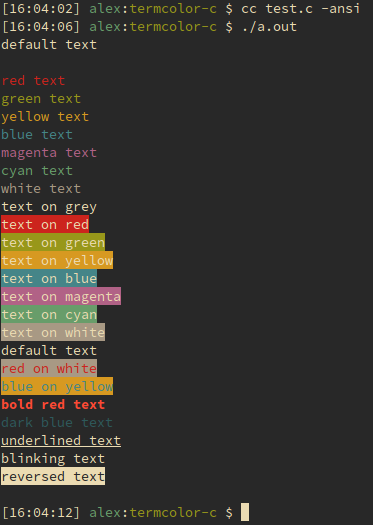

# termcolor-c

A header-only ANSI C library for writing colored text to the terminal, based on
[Termcolor](https://github.com/ikalnytskyi/termcolor) for C++.



Like Termcolor, it uses ANSI escape codes to modify text attributes.
This should work on most terminals, at least for POSIX-like systems.
Note that unlike Termcolor, Windows is not yet supported here.

## Usage

Add `termcolor-c.h` to your project and `#include` it.

The idea behind termcolor, which is mimicked in termcolor-c, is to manipulate the
underlying stream to which text is written.
As an example:

```c
#include <stdio.h>
#include "termcolor-c.h"

int main(int argc, char** argv) {
    fputs("Hello, colorful world\n", text_red(stdout));
    reset_colors(stdout);
    return 0;
}
```

If you compile this and run it, you'll find that "Hello, colorful world" has been
printed to STDOUT in red.
Note that if you don't call `reset_colors`, text in the terminal will continue to
be red even after the program has finished executing.

## Supported attributes

### Foreground colors

* `text_gray` and `text_grey`
* `text_red`
* `text_green`
* `text_yellow`
* `text_blue`
* `text_magenta`
* `text_cyan`
* `text_white`

### Background colors

* `background_grey` and `background_gray`
* `background_red`
* `background_green`
* `background_yellow`
* `background_blue`
* `background_magenta`
* `background_cyan`
* `background_white`

### Text style

* `text_bold`
* `text_dark`
* `text_underline`
* `text_blink` (may not be supported in many terminals)
* `text_reverse` (may not be supported in many terminals)
* `text_concealed` (may not be supported in many terminals)

## License

Licensed under the terms of the 2-clause "simplified" BSD license.
See `LICENSE`.
